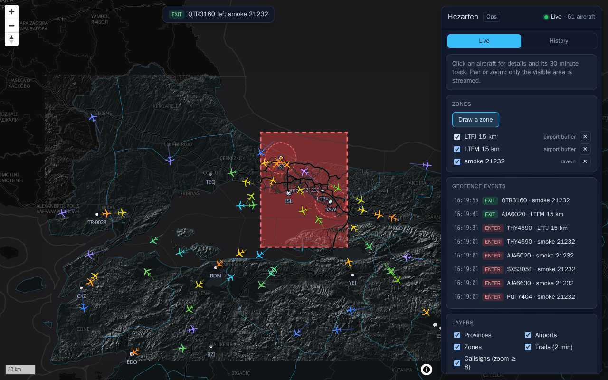
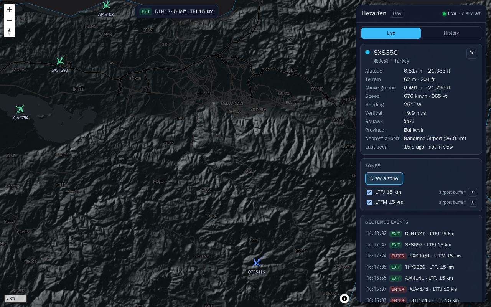
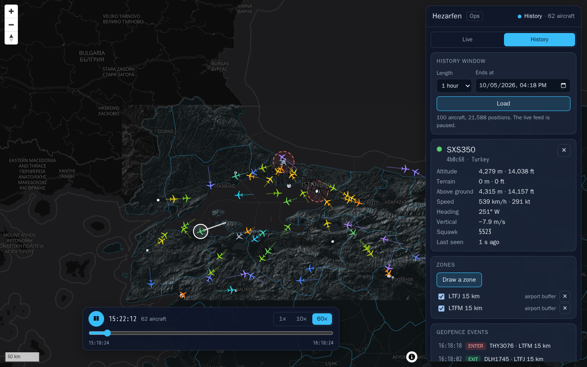
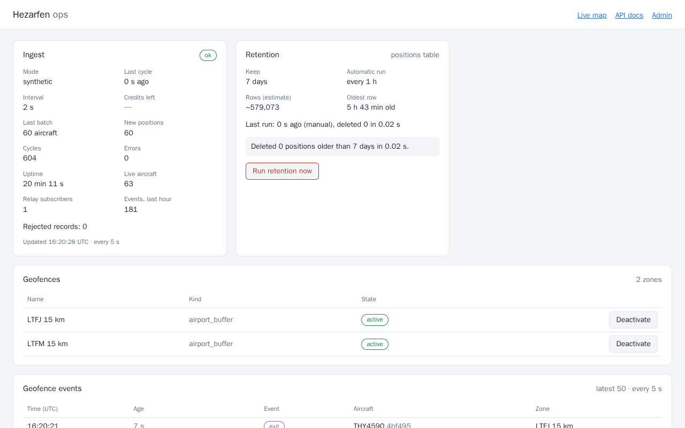
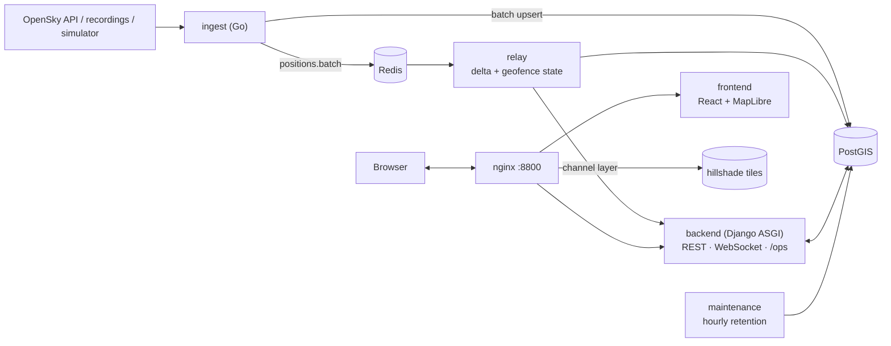

# Hezarfen

Real-time air traffic and geospatial analysis for the Marmara region of Türkiye. A Go service polls ADS-B positions (OpenSky Network, or a recording, or a built-in simulator), PostGIS stores them, a Django relay streams them over WebSockets to a React + MapLibre map, and the same map runs the geospatial work: geofence alerts, track playback, terrain and height above ground. A server-rendered HTMX panel shows how the pipeline is doing.

> Status: **all phases (0–8) done.** Progress log: [PROGRESS.md](PROGRESS.md) · 5-minute walkthrough: [docs/DEMO.md](docs/DEMO.md)

| Live map with a drawn geofence | Terrain, height above ground |
|---|---|
|  |  |
| **History playback** | **Ops panel (Django + HTMX)** |
|  |  |

## What it does

- **Live map:** aircraft icons rotate with their heading and are coloured by altitude; only the visible area is streamed (WebSocket, at most one delta per second).
- **Geofences:** 15 km zones around Istanbul's two airports plus zones you draw on the map; enter/exit events are detected server-side and pushed to the browser within a second.
- **Track and playback:** the selected aircraft's last 30 minutes; any past window up to 2 hours replayed at 1×/10×/60× with interpolated motion.
- **Terrain:** Copernicus DEM → hillshade tiles and an elevation API; aircraft details show terrain under the aircraft, height above ground and a low-flight badge.
- **Operations:** `/ops/` shows ingest health (mode, last cycle, OpenSky credits, rejections), the latest geofence events (self-refreshing), switches for geofences and on-demand retention. Old position history is pruned hourly.

## Architecture



Eight services in one compose project (`db`, `redis`, `backend`, `relay`, `maintenance`, `ingest`, `frontend`, `nginx`) plus an on-demand GDAL toolbox. Details: [docs/ARCHITECTURE.md](docs/ARCHITECTURE.md). Every interface between them (database tables, Redis messages, WebSocket, REST, files) is specified in [docs/ICD.md](docs/ICD.md).

**Stack:** Go 1.27 · Django 6.1 (GeoDjango, DRF, Channels) · PostgreSQL 18 + PostGIS 3.6 · Redis 8 · React 19 + TypeScript + MapLibre GL JS · HTMX 2 · GDAL · nginx · Docker Compose.

## Quick start

Requirements: Docker (with Compose v2), `make`, `git`. No Go, Node, Python or GDAL needed on the host: every tool runs in a container.

```bash
git clone <this repo> hezarfen && cd hezarfen
make up          # creates .env from .env.example, builds, starts the dev stack, waits until healthy
make seed        # airports (OurAirports) + provinces (Natural Earth) + the two airport geofences
make dem         # optional: Copernicus DEM -> elevation COG + hillshade tiles (~70 MB download, ~30 s)
make smoke       # curl checks through nginx
```

Open <http://localhost:8800/> for the map and <http://localhost:8800/ops/> for the ops panel. With no OpenSky credentials the ingest service runs in **synthetic** mode: 60 simulated aircraft flying between the region's airports, so everything works offline (`make seed REFERENCE_OFFLINE=1` uses bundled fixtures instead of downloads).

| Command | What it does |
|---|---|
| `make up` / `make down` | Dev stack with hot reload (Django, relay, Go via air, Vite HMR) / stop it (`make clean` also drops the database) |
| `make up-prod` | Production-like stack: prod images, non-root, static frontend |
| `make test` | Go, frontend (vitest) and backend (pytest on real PostGIS) suites |
| `make lint` / `make lint-ci` | go vet + gofmt, tsc + eslint, ruff + migration check / actionlint + shellcheck |
| `make smoke` / `make ui-smoke` | curl checks / headless-browser checks of the running stack (screenshots in `data/ui-smoke/`) |
| `make logs s=ingest` | Follow one service's logs |
| `make ws` | Tail the live WebSocket feed in the terminal |
| `make prune` | Run retention now |
| `make superuser` | Django admin user (geofences on a map at `/admin/`) |
| `make psql` | psql into PostGIS |

Host ports (override in `.env`): `8800` (nginx, the only public entry point), `127.0.0.1:55432` (PostGIS) and `127.0.0.1:56379` (Redis) for debugging with psql, QGIS or redis-cli.

## Data sources

The Go ingest service has four modes, chosen with `SOURCE_MODE` in `.env`:

| Mode | What it does |
|---|---|
| `auto` (default) | `live` if OpenSky credentials are set, else `replay` if `data/raw/` has recordings, else `synthetic` |
| `synthetic` | No network: 60 simulated aircraft flying great-circle routes between the region's airports (most via LTFM/LTFJ, so geofence alerts fire) plus overflights |
| `replay` | Plays recorded OpenSky responses (`REPLAY_DIR`, default `data/raw/`) re-timed to now, `REPLAY_SPEED` times faster |
| `live` | Polls OpenSky every 10 s (30 s when credits drop below 20%) and archives every raw response to `data/raw/YYYY-MM-DD/HHMMSS.json.gz` |

Out of the box the stack runs `synthetic`. The ops panel and `/api/stats` show the resolved mode. To watch the data flow:

```bash
docker compose exec redis redis-cli SUBSCRIBE positions.batch     # one message per cycle
docker compose exec backend python -c "import urllib.request; print(urllib.request.urlopen('http://ingest:8080/metrics').read().decode())"
```

Replay the bundled real recording (25 snapshots of the Marmara sky, recorded anonymously) in the dev stack: set `SOURCE_MODE=replay` and `REPLAY_DIR=/src/testdata/opensky` in `.env`, then `make up`. `make record` records a fresh one (anonymous, 25 credits).

### Live mode (OpenSky account)

1. Create a free account at [opensky-network.org](https://opensky-network.org/), then open **Account → API Client** and create a client. You get a client id and a client secret (OAuth2 client credentials; OpenSky no longer accepts username/password for the API).
2. Put them in `.env` (never commit this file):
   ```bash
   OPENSKY_CLIENT_ID=your-client-id
   OPENSKY_CLIENT_SECRET=your-client-secret
   ```
3. `make up`. With `SOURCE_MODE=auto` ingest switches to `live`; `make logs s=ingest` shows `"mode":"live"` and `/metrics` shows `credits_remaining`.

Budget: a registered client has 4,000 credits per day and this region costs 1 credit per request, so 10 s polling lasts about 11 hours before adaptive polling slows down. For all-day running set `POLL_INTERVAL_SECONDS=20` or more. Live mode without credentials also works (anonymous, 400 credits per day). Raw recordings accumulate in `data/raw/` and become replay material.

Host ports (override in `.env`): `8800` (nginx, the only public entry point), `127.0.0.1:55432` (PostGIS) and `127.0.0.1:56379` (Redis) for debugging.

## REST API

Swagger UI: <http://localhost:8800/api/docs/> (OpenAPI schema at `/api/schema/`). Contract: [docs/ICD.md §7](docs/ICD.md).

```bash
curl 'localhost:8800/api/aircraft/live?bbox=28.5,40.7,29.5,41.4'   # GeoJSON, last 60 s
curl  localhost:8800/api/aircraft/<icao24>/                         # + province, nearest airport
curl  localhost:8800/api/aircraft/<icao24>/track                    # LineString, last 30 min
curl 'localhost:8800/api/playback?bucket=30'                        # last 15 min in frames
curl  localhost:8800/api/stats
curl -X POST localhost:8800/api/geofences/ -H 'Content-Type: application/json' -d '{"type":"Feature",
  "geometry":{"type":"Polygon","coordinates":[[[28.9,41.0],[29.0,41.0],[29.0,41.1],[28.9,41.1],[28.9,41.0]]]},
  "properties":{"name":"Bosphorus box"}}'
```

The API has no authentication: it is meant for a local, single-user deployment.

## Live WebSocket

`ws://localhost:8800/ws/live/` streams the live picture ([docs/ICD.md §6](docs/ICD.md)): send `{"type":"subscribe","bbox":[minLon,minLat,maxLon,maxLat]}`, receive a `snapshot`, then at most one `delta` per second for that bbox, every `geofence_event` (enter/exit) and a `heartbeat` every 15 s. The handshake must carry an allowed `Origin` header (browsers do this themselves).

```bash
make ws                                          # 15 s through nginx, one line per message
make ws args="--seconds 60 --bbox 28.5,40.8,29.5,41.4"
make ws args="--raw"                             # full JSON frames
```

Geofence events are produced by the `relay` worker (`make logs s=relay`) and stored in `geofence_events` (`/api/geofence-events`).

## Live map

`http://localhost:8800/` is a React + TypeScript single-page app around a MapLibre GL JS map (basemap: OpenFreeMap `dark`, with an offline fallback style).

- Aircraft icons rotate with their heading and are coloured by barometric altitude; aircraft on the ground are grey. Callsigns appear from zoom 8.
- The page keeps one WebSocket open and re-subscribes with the viewport bbox (+10 %) after every pan or zoom, so only the visible area is streamed. It reconnects with exponential backoff; the status badge shows `Live`, `Connecting…` or the retry countdown.
- Click an aircraft for details: live altitude, speed, heading and squawk from the socket, plus province and nearest airport from `GET /api/aircraft/{icao24}/`.
- Provinces, airports, geofences and callsigns can be toggled. The panel lists recent geofence enter/exit events; clicking one flies to the aircraft.
- Narrower than 640 px (phones), the side panel becomes a bottom sheet.
- Selecting an aircraft draws its last 30 minutes (`GET /api/aircraft/{icao24}/track`) and the line keeps growing with live updates. Every live aircraft also has a 2-minute tail (layer "Trails").
- **History** mode pauses the WebSocket and replays a past window (15 min – 2 h, any end time) from `GET /api/playback`: play/pause, time slider, 1×/10×/60×. Positions are interpolated between frames, so motion is smooth at any speed.
- **Zones:** "Draw a zone" starts polygon drawing ([terra-draw](https://github.com/JamesLMilner/terra-draw)); click corners, click the first corner to close, name it and save (`POST /api/geofences/`). Zones can be switched active/inactive or deleted from the list. A live enter/exit event shows a toast, lands in the event list and makes its zone blink.

```bash
make ui-smoke    # headless Chromium (Playwright image): map, WebSocket frames, 375 px layout, track, playback, zone drawing
```

`make ui-smoke` writes screenshots to `data/ui-smoke/`. The first run pulls the ~2 GB Playwright image. In the dev server the map is exposed as `window.__map` for console debugging.

## Terrain

`make dem` runs [scripts/prepare_dem.sh](scripts/prepare_dem.sh) in a GDAL container (`gdal` service, `tools` profile):

1. downloads the Copernicus DEM GLO-90 tiles covering the region bbox (1°×1°, cached in `data/dem/src/`),
2. prints `gdalinfo` for one tile and mosaics them into a VRT (`gdalbuildvrt`),
3. crops to the bbox as a Cloud Optimized GeoTIFF in EPSG:4326 for sampling (`data/dem/dem_4326_cog.tif`),
4. reprojects to EPSG:3857 (bilinear), computes a hillshade (`gdaldem`, z-factor corrects the Mercator stretch),
   turns it into black/white with alpha so flat ground and the sea stay transparent,
5. cuts XYZ PNG tiles for zoom 6–11 (`gdal2tiles`) into `data/tiles/hillshade/`, served by nginx at `/tiles/hillshade/`.

If the download fails (no network), `DEM_SOURCE=auto` (default) falls back to a **synthetic** surface (Gaussian hills
roughly where the real mountains are); the map's layer panel then marks the hillshade as "synthetic". Force a source with
`make dem DEM_SOURCE=copernicus` or `DEM_SOURCE=synthetic`. Rerunning is safe: the backend picks up a rebuilt COG without a restart.

```bash
curl 'localhost:8800/api/terrain/elevation?lon=29.2213&lat=40.0703'   # Uludağ: {"elevation_m": 2506.4, ...}
```

In the map, "Hillshade" (layer panel, with an opacity slider) shows the relief; the aircraft details show the terrain
elevation under the aircraft and its height above ground (AGL = GNSS altitude − terrain), with a **Low flight** badge below
300 m AGL outside the airport zones. Heights are approximate: GLO-90 is a surface model (buildings and forest canopy
included) referenced to the EGM2008 geoid, while ADS-B geometric altitude is usually height above the WGS84 ellipsoid
(about 36–40 m higher in this region).

## Ops panel

`http://localhost:8800/ops/` is a server-rendered page (Django templates + [HTMX](https://htmx.org/), no JavaScript build):

- **Ingest:** mode, last cycle, interval, OpenSky credits left (and % of the daily budget in live mode), batch size, errors, rejected records per cleaning rule, live aircraft. Refreshes every 5 s while the tab is visible.
- **Geofence events:** the latest 50, refreshing every 5 s.
- **Geofences:** activate/deactivate buttons; the relay picks the change up immediately (same notification as the REST API).
- **Retention:** rows (estimate), oldest row, the last run and a "Run retention now" button.

The `maintenance` service deletes positions older than `POSITIONS_RETENTION_DAYS` (default 7) every `RETENTION_INTERVAL_SECONDS` (default 3600), in batches of 20,000 rows. Like the REST API, the panel has no login (local single-user deployment); its POSTs are CSRF-protected.

## Tests and CI

- **Backend:** pytest against a real PostGIS (spatial SQL, migrations, GiST/BRIN behaviour cannot be faked by SQLite), plus pure-logic tests (geofence state machine, delta coalescing, sampling maths, scheduler).
- **Ingest:** Go unit tests (parsing, cleaning rules, synthetic flights); store/publish integration tests against the migrated schema and Redis.
- **Frontend:** vitest for the pure modules (message parsing, delta store, interpolation, bbox, terrain helpers).
- **End to end:** `make smoke` (HTTP) and `make ui-smoke` (Playwright: map, WebSocket frames, drawing a zone and waiting for a real boundary crossing, playback speed, terrain, ops panel, 375 px layout).

[.github/workflows/ci.yml](.github/workflows/ci.yml) runs Go vet/fmt/test, ruff + pytest with a PostGIS service container, the Go↔PostGIS integration tests, tsc/eslint/vitest/build, and finally builds every image, starts the prod-like stack, seeds it offline and runs `make smoke`.

## Repository layout

```
ingest/      Go service: sources (live, replay, synthetic), cleaning, PostGIS writer, Redis publisher, /metrics
backend/     Django project: tracking, reference, geofencing, terrain, realtime (relay, WebSocket), ops (panel, maintenance)
frontend/    React + TypeScript + MapLibre single-page app
nginx/       Gateway config
scripts/     Reference data and DEM pipelines, smoke tests, fixtures
docs/        ICD, architecture, decision log, demo script, phase plans
```

## Documentation

- [docs/DEMO.md](docs/DEMO.md) — a 5-minute demo script
- [docs/ARCHITECTURE.md](docs/ARCHITECTURE.md) — components, data flow, CI, environments
- [docs/ICD.md](docs/ICD.md) — interface contract (Redis messages, WebSocket, REST, files, units)
- [docs/DECISIONS.md](docs/DECISIONS.md) — decision log with alternatives (Turkish)

## Data sources, licences and attribution

- **Aircraft positions:** [The OpenSky Network](https://opensky-network.org/). OpenSky data is provided for research and non-commercial use under the terms of use published on its website; this project is non-commercial. Recordings in `data/raw/` and `ingest/testdata/` are OpenSky data and fall under the same terms.
- **Basemap:** [OpenFreeMap](https://openfreemap.org/) tiles, © [OpenMapTiles](https://openmaptiles.org/) © [OpenStreetMap](https://www.openstreetmap.org/copyright) contributors (ODbL).
- **Terrain:** Copernicus DEM GLO-90 © DLR e.V. 2010-2014 and © Airbus Defence and Space GmbH 2014-2018, provided under COPERNICUS by the European Union and ESA; all rights reserved.
- **Province boundaries:** [Natural Earth](https://www.naturalearthdata.com/) admin-1 (public domain).
- **Airports:** [OurAirports](https://ourairports.com/data/) (public domain).
- **Libraries:** MapLibre GL JS (BSD-3-Clause), terra-draw (MIT), HTMX (Zero-Clause BSD, vendored in `backend/ops/static/ops/`), and the Go, Python and npm dependencies pinned in `go.mod`, `requirements.txt` and `package-lock.json`.
