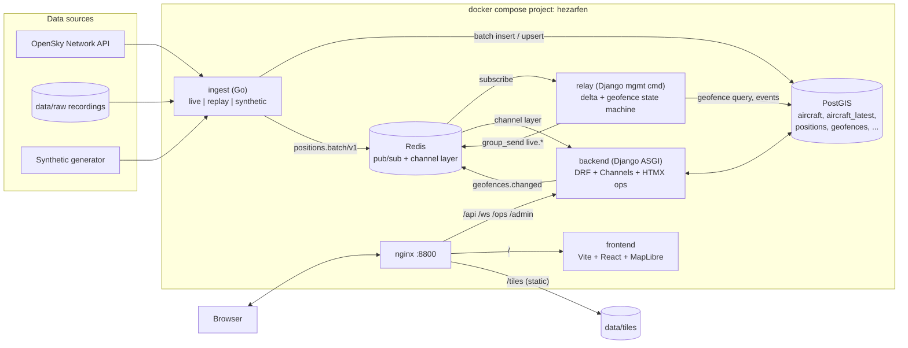
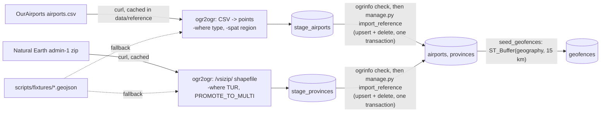
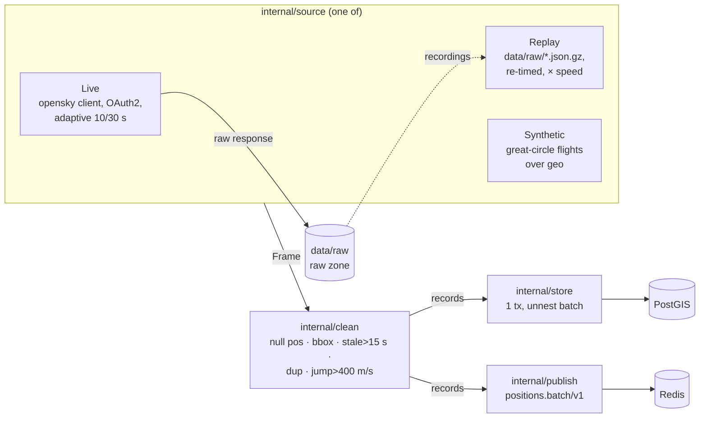

# Hezarfen — Architecture

Hezarfen tracks air traffic over the Marmara region in real time and runs geospatial analyses (geofences, terrain, playback) on the same map. Interfaces between components are specified in [ICD.md](ICD.md); decisions and their alternatives are logged in [DECISIONS.md](DECISIONS.md).

## Component view



## Request paths

| Path | Through nginx to | Purpose |
|---|---|---|
| `/` | `frontend:5173` | SPA (Vite dev server with HMR in dev, static build in prod) |
| `/api/` | `backend:8000` | REST API (DRF, GeoJSON) |
| `/ws/` | `backend:8000` (Upgrade) | Live WebSocket feed (Channels) |
| `/ops/` | `backend:8000` | HTMX operations panel |
| `/admin/` | `backend:8000` | Django admin with map widgets |
| `/tiles/` | nginx filesystem | Pre-rendered hillshade tiles |

## Live data flow

```mermaid
sequenceDiagram
    participant I as ingest
    participant P as PostGIS
    participant R as Redis
    participant W as relay
    participant B as backend (consumer)
    participant C as browser

    C->>B: WS connect /ws/live/
    C->>B: {"type":"subscribe","bbox":[...]}
    B->>P: aircraft_latest within bbox
    B-->>C: snapshot
    loop every ingest cycle
        I->>P: INSERT positions ON CONFLICT DO NOTHING; UPSERT aircraft_latest
        I->>R: PUBLISH positions.batch
        R->>W: message
        W->>P: one ST_Contains query for the whole batch vs. active geofences
        W->>P: INSERT geofence_events (on state change)
        W->>R: group_send live.delta / live.geofence_event (≤ 1/s)
        R->>B: channel layer
        B-->>C: delta (filtered by bbox), geofence_event
    end
```

## Reference data load (`make seed`)



Django apps: `tracking` (aircraft, aircraft_latest, positions), `reference` (airports, provinces), `geofencing` (geofences, geofence_events), `terrain` (Phase 7), `ops` (health, ops panel).

## Ingest pipeline (Go)



`cmd/ingest` resolves the mode (`auto` → live / replay / synthetic), waits for PostGIS and Redis, then loops extract → clean → load until SIGTERM. Each cycle is one database transaction and one Redis message; failures are counted in `/metrics` and never stop the loop. The ingest container runs as the host uid so `data/raw` recordings belong to the developer.

## Environments

- **Dev** (`make up`): `docker-compose.yml` + `docker-compose.override.yml` (dev images tagged `:dev`, so they never overwrite the prod images). Source is bind-mounted; uvicorn (`--reload`, watchfiles), `watchfiles` for the relay, `air` for Go and Vite HMR reload on save via inotify (the repo lives on WSL ext4).
- **Prod-like** (`make up-prod`): only `docker-compose.yml`. Images are built with `target: prod` (non-root backend, distroless Go binary, static frontend served by nginx).
- **Isolation:** compose project `name: hezarfen`, no `container_name`. Host ports: 8800 (nginx), and 127.0.0.1-only 55432 (PostGIS) and 56379 (Redis) for debugging.

## Ownership rules

- **Schema:** Django migrations own every table. Ingest writes to fixed table names (`Meta.db_table`) and never runs DDL.
- **Source of truth:** PostGIS. Redis pub/sub is a notification bus; anything missed there can be recovered from the database.
- **Contracts:** `docs/ICD.md` first, code second.
